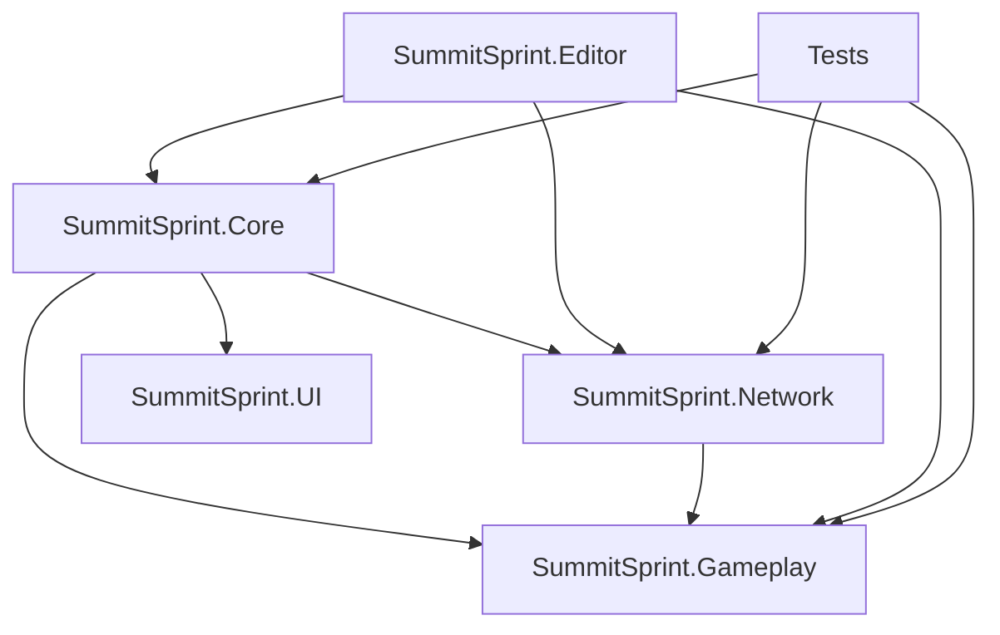

# Assembly Definition Planning for SummitSprint

## Current Status: GOOD FOR NOW ✅
- **Scripts Count**: 8 scripts
- **Compile Time**: Fast
- **Recommendation**: Keep current setup until ~15-20 scripts

## Future Assembly Architecture (When Needed)

### Recommended Assembly Structure

```
Assets/Game/Scripts/
├── Core/                        → SummitSprint.Core.asmdef
│   ├── Managers/
│   ├── Systems/ 
│   └── Utilities/
├── Network/                     → SummitSprint.Network.asmdef
│   └── (networking scripts)
├── Gameplay/                    → SummitSprint.Gameplay.asmdef  
│   ├── Player/
│   ├── Physics/
│   └── Mechanics/
└── Config/                      → SummitSprint.Core.asmdef

Assets/UI/Scripts/               → SummitSprint.UI.asmdef
Assets/Tools/Editor/             → SummitSprint.Editor.asmdef
Assets/Tests/                    → Tests.asmdef (already good)
```

### Assembly Dependencies (Future)



### Assembly Definition Templates

#### 1. Core Assembly (Future)
```json
{
    "name": "SummitSprint.Core",
    "rootNamespace": "SummitSprint.Core",
    "references": [
        "Unity.Services.Core",
        "Unity.Services.Authentication"
    ],
    "includePlatforms": [],
    "excludePlatforms": [],
    "allowUnsafeCode": false,
    "overrideReferences": false,
    "precompiledReferences": [],
    "autoReferenced": true,
    "defineConstraints": [],
    "versionDefines": [],
    "noEngineReferences": false
}
```

#### 2. Network Assembly (Future)
```json
{
    "name": "SummitSprint.Network",
    "rootNamespace": "SummitSprint.Network", 
    "references": [
        "SummitSprint.Core",
        "Unity.Netcode.Runtime",
        "Unity.Services.Lobbies",
        "Unity.Services.Relay"
    ],
    "includePlatforms": [],
    "excludePlatforms": [],
    "allowUnsafeCode": false,
    "overrideReferences": false,
    "precompiledReferences": [],
    "autoReferenced": true,
    "defineConstraints": [],
    "versionDefines": [],
    "noEngineReferences": false
}
```

#### 3. UI Assembly (Future)
```json
{
    "name": "SummitSprint.UI",
    "rootNamespace": "SummitSprint.UI",
    "references": [
        "SummitSprint.Core",
        "SummitSprint.Network",
        "Unity.InputSystem",
        "Unity.TextMeshPro"
    ],
    "includePlatforms": [],
    "excludePlatforms": [],
    "allowUnsafeCode": false,
    "overrideReferences": false,
    "precompiledReferences": [],
    "autoReferenced": true,
    "defineConstraints": [],
    "versionDefines": [],
    "noEngineReferences": false
}
```

## Migration Timeline

### Phase 1: Growth Monitoring
- **Trigger**: When compilation takes >3-5 seconds
- **Metric**: 15-20 scripts total
- **Action**: Reassess assembly needs

### Phase 2: Core Extraction (First Split)
1. Create `SummitSprint.Core.asmdef` in `Assets/Game/Scripts/Core/`
2. Move managers and systems to Core folder
3. Update Tests.asmdef to reference SummitSprint.Core

### Phase 3: Network Separation
1. Create `SummitSprint.Network.asmdef`
2. Move networking scripts to Network folder
3. Reference Core assembly

### Phase 4: UI Separation
1. Create `SummitSprint.UI.asmdef` 
2. Reference Core and Network assemblies
3. Isolate UI logic

## Benefits of Future Assembly Organization

### Compilation Speed
```
Before: Change UGSManager → Recompile ALL scripts
After:  Change UGSManager → Recompile Core assembly only
```

### Architecture Enforcement  
```
Before: Any script can reference anything
After:  Clear dependency hierarchy enforced
```

### Team Development
```
Before: Everyone touches Assembly-CSharp
After:  Clear ownership boundaries
```

## Testing the Current Setup

### Quick Test: Are References Problematic?

Check if any of these exist in your current code:

❌ **Bad Dependencies** (check for these):
```csharp
// In GameLogger.cs - referencing UI
using UnityEngine.UI;

// In UGSManager.cs - referencing specific gameplay
using SummitSprint.Gameplay;

// In DebugUIPanel.cs - directly managing core systems
UGSManager.Instance.DoSomething();
```

✅ **Good Dependencies** (your current style):
```csharp
// Core systems managing themselves
UGSManager.Instance.InitializeUGS();

// UI calling public APIs
GameLogger.Log("message");

// Proper event-driven communication
OnLobbiesUpdated?.Invoke(lobbies);
```

## Validation Commands

Test current compilation times:
```bash
# Time a full recompilation
time Unity -batchmode -quit -projectPath . -executeMethod UnityEditor.EditorApplication.Exit

# Check script compilation in Unity
# Window > General > Console
# Look for "Scripts have been recompiled" messages
```

## Decision Matrix

| Project Size | Scripts | Compile Time | Action |
|--------------|---------|--------------|--------|
| Small | 1-10 | <1 sec | ✅ Keep default |
| Medium | 10-20 | 1-3 sec | ⚠️ Monitor |
| Large | 20-50 | 3-10 sec | 🔄 Create assemblies |
| Enterprise | 50+ | 10+ sec | 🚨 Must have assemblies |

**Current Status**: Small → ✅ Keep default

## Red Flags That Trigger Assembly Reorganization

1. **Compilation Time** > 3 seconds
2. **Script Count** > 15-20
3. **Circular Dependencies** between systems
4. **Team Size** > 3 developers
5. **Platform Builds** taking too long

None of these apply to your current project! 🎉
